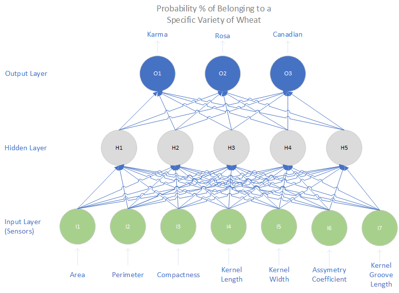
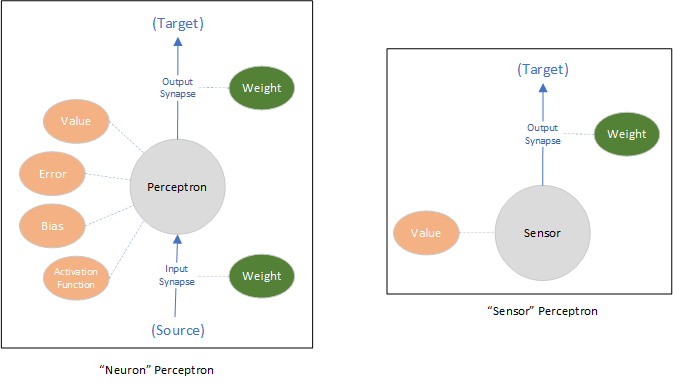

Perceptron
==========

This repo is mainly a way for me to understand neural networks, backpropagation and some basics of machine learning.

To run in, just do:
```
go run cmd/main.go
```

Sample output:
```
$ go run cmd/main.go
Perceptron
==========

Training....
Final error on 1000 epochs: 4.002609

Predicting....
Accuracy on 210 predictions: 99.047619%
```

The main program will load a [dataset](http://archive.ics.uci.edu/dataset/236/seeds) from UC Irvine containing a classification of wheat seeds based on its geometrical properties. Then it will create a neural network with 3 "layers": 

* an Input layer with 7 nodes (one for each input property)
* a hidden layer with 5 nodes
* an output layer with 3 nodes (one for each possible class of seed)

Then the network will be trained with the given dataset, and finally we again use the same dataset to let the network "predict" the classification of each seed based on its inputs.

The network configuration can be chaned in `cmd/main.go` on this line:

```
    nn := neuralnet.New(7,5,3)
```

Wheat Classification Neural Network
-----------------------------------



Each "node" on the neural network is implemented as a [perceptron](pkg/perceptron/perceptron.go). A perceptron is the basic unit of the network and tries to mimic the role of a neuron on the brain. There are 2 types of perceptrons: "neurons" and "sensors". 



Perceptrons are connected to other perceptrons via synapses, which can be input or output synapses. Neurons have input synapses (meaning they receive signals from other perceptrons) and may have output synapses. Only the outer "output" layer of neurons do not have output synapses.

Sensors are simplified Perceptrons. They only connect to other neurons via output synapses. Their role is to "sense" external values and feed them into the neural network.

All perceptrons have a value, an error measure (calculated during training when comparing the expected value with their actual value), a bias and and activation function. Bias and Activation functions are used to transform the inputs received into the output that is fed to the connected neurons.

Every synapse also has a weight, which determines "how much" that particular signal from the source neuron affects the target neuron. The "training" of a network is the process by which all weights are fine-tuned so that the desired output is achieved.

An important detail is that an individual node has no knowledge of the network as a whole. The neuron is only "aware" of its inmmediate surroundings and can only "see" its inputs and generate a signal to pass to its connected neurons (if any). Even the training process is based on propagating signals via the existing connections on the network. Each node tells its connected nodes to "train" itself.
